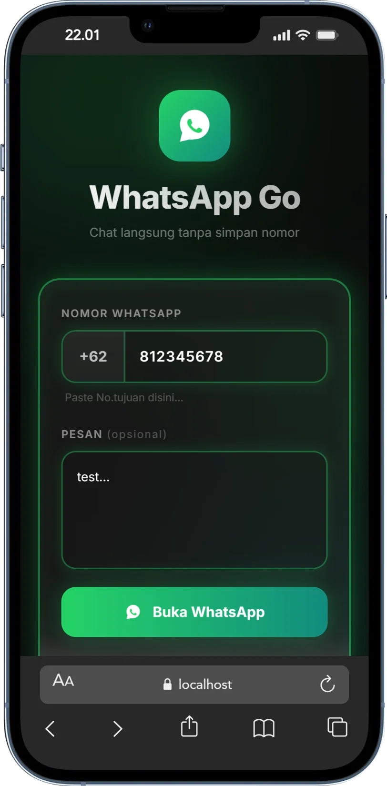

# Chat2goo

Aplikasi chat real-time dengan fitur panggilan suara/video, notifikasi push, dan dukungan dark mode. Dibangun dengan React + Vite, Supabase, dan Capacitor untuk Android.

## 📸 Screenshots

<div align="center">
  
  
  
  
  <br><br>
  
  
  
</div>

## ✨ Fitur

- **Real-time Messaging** - Kirim pesan teks, gambar, file, audio, dan video
- **Emoji Picker** - Kirim emoji dengan dukungan dark mode
- **Voice/Video Calls** - Panggilan suara dan video dengan WebRTC
- **Push Notifications** - Notifikasi pesan dan panggilan masuk
- **QR Code** - Scan QR code untuk menambah kontak
- **Dark Mode** - Dukungan tema gelap
- **Contact Management** - Kelola kontak dan profil pengguna
- **Notification Settings** - Atur suara dan getaran notifikasi
- **Theme Settings** - Kustomisasi tema aplikasi

## 🛠️ Tech Stack

- **Frontend**: React 18 + Vite
- **Styling**: Tailwind CSS + shadcn/ui
- **Backend**: Supabase (PostgreSQL, Auth, Realtime, Storage)
- **Mobile**: Capacitor (Android)
- **State Management**: TanStack Query
- **Routing**: React Router DOM
- **Icons**: Lucide React
- **Forms**: React Hook Form + Zod

## 📋 Prerequisites

- Node.js 18+
- npm atau yarn
- Android Studio (untuk build Android)
- JDK 17+
- Android SDK

## 🚀 Installation

### 1. Clone Repository

```bash
git clone <repository-url>
cd ChatApps
```

### 2. Install Dependencies

```bash
npm install
```

### 3. Setup Environment Variables

Buat file `.env.local`:

```env
VITE_SUPABASE_URL=your_supabase_url
VITE_SUPABASE_ANON_KEY=your_supabase_anon_key
```

### 4. Run Development Server

```bash
npm run dev
```

Aplikasi berjalan di `http://localhost:5173`

## 📱 Build Android

### 1. Build Web App

```bash
npm run build
```

### 2. Sync Capacitor

```bash
npx cap sync android
```

### 3. Build APK

```bash
cd android
./gradlew assembleRelease
```

APK tersedia di: `android/app/build/outputs/apk/release/app-release.apk`

### 4. Install ke Device

```bash
adb install -r android/app/build/outputs/apk/release/app-release.apk
```

## 📁 Project Structure

```
ChatApps/
├── android/                 # Capacitor Android project
│   └── app/src/main/java/com/chat2goo/app/
│       ├── ChatFirebaseMessagingService.java  # FCM handler
│       ├── CallNotificationPlugin.java        # Call notifications
│       └── MainActivity.java                  # Main activity
├── src/
│   ├── api/                 # API functions
│   ├── components/
│   │   ├── call/            # Call UI components
│   │   ├── chat/            # Chat UI components
│   │   └── ui/              # shadcn/ui components
│   ├── hooks/               # Custom React hooks
│   ├── lib/                 # Utilities
│   ├── pages/               # Page components
│   │   ├── ChatList.jsx     # Chat list
│   │   ├── ChatRoom.jsx     # Chat room
│   │   ├── Contacts.jsx     # Contacts
│   │   ├── Login.jsx        # Login
│   │   ├── Profile.jsx      # Profile
│   │   ├── QRPage.jsx       # QR scanner
│   │   ├── NotificationSettings.jsx
│   │   └── ThemeSettings.jsx
│   ├── utils/               # Utility functions
│   ├── App.jsx              # Main app component
│   └── main.jsx             # Entry point
├── supabase/                # Supabase config
├── capacitor.config.ts      # Capacitor config
├── tailwind.config.js       # Tailwind config
└── vite.config.js           # Vite config
```

## 🔧 Available Scripts

| Script | Description |
|--------|-------------|
| `npm run dev` | Run development server |
| `npm run build` | Build for production |
| `npm run preview` | Preview production build |
| `npm run lint` | Run ESLint |
| `npm run lint:fix` | Fix ESLint errors |
| `npm run typecheck` | Run TypeScript check |

## 🔐 Environment Variables

| Variable | Description |
|----------|-------------|
| `VITE_SUPABASE_URL` | Supabase project URL |
| `VITE_SUPABASE_ANON_KEY` | Supabase anonymous key |

## 📲 Android Features

- **Push Notifications** - FCM untuk pesan dan panggilan
- **Call Notifications** - Notifikasi panggilan masuk dengan ringtone
- **Audio Routing** - Audio otomatis ke earpiece saat panggilan
- **Splash Screen** - Splash screen kustom

## 🎨 UI Components

Menggunakan komponen dari shadcn/ui:
- Button, Card, Dialog, Dropdown
- Form, Input, Select, Switch
- Toast, Tooltip, Avatar
- Dan banyak lagi...

## ⚠️ Known Issues

### 🔊 Audio Routing
- **Loudspeaker Issue** - Saat panggilan, audio masih keluar melalui loudspeaker. Earpiece routing belum berfungsi dengan baik.

### 🔒 Lockscreen
- **Lockscreen Call** - Notifikasi panggilan di lockscreen belum berfungsi optimal. Perlu perbaikan untuk menampilkan UI panggilan saat layar terkunci.

### 🔐 Privacy
- **Privacy Page** - Halaman privasi masih dalam tahap pengembangan. Fitur pengaturan privasi belum lengkap.

## 📝 License

MIT License

## 👥 Contributing

1. Fork repository
2. Buat branch fitur (`git checkout -b feature/amazing-feature`)
3. Commit perubahan (`git commit -m 'Add amazing feature'`)
4. Push ke branch (`git push origin feature/amazing-feature`)
5. Buat Pull Request
